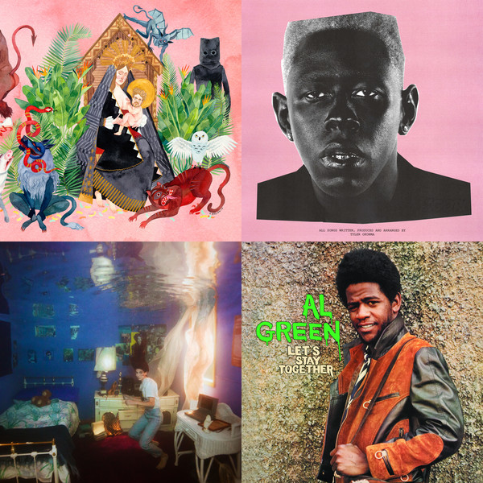
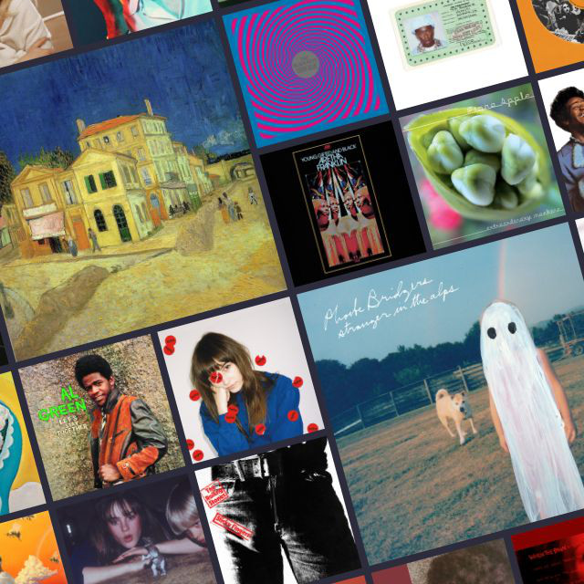

# 💿 Spotify CoverGen

    

[Spotify CoverGen](https://spotify-covergen.herokuapp.com) is a tool to create stylish covers for your Spotify playlists ✨

## Why make this?
Let's face it, the default Spotify playlist covers are pretty ugly:

    

My cover generator takes the beautiful album artwork from your playlists and arranges into a masonry layout. Here's a much nicer cover that I created for that same playlist:

    

## Spotify Development Mode

Unfortunately, Spotify placed my app in development mode, which means I have to manually grant access to each new user. If you're interested, please [send me](mailto:zbreit18@gmail.com) a message with the email address that you use for your Spotify account.
